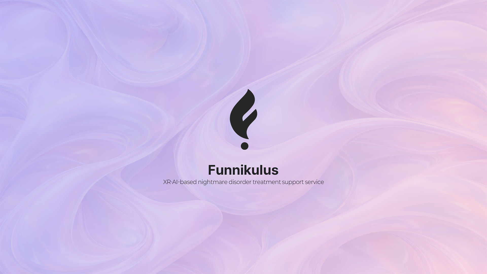

# Spoof!

**XR · AI 기반 악몽 장애 치료 보조 서비스** | [Dream Labs](https://funnikulus.com/ko)

---

## 왜 Funnikulus인가

악몽 장애에 가장 널리 쓰이는 **이미지 리허설 요법(IRT)**는, 악몽 시나리오를 반복적으로 상상하고 재구성해 통제감을 회복하는 치료법이에요. 다만 환자의 **몰입도와 상상력**에 많이 의존하기 때문에, 실제로 **환자의 약 30%는 치료 효과를 거의 보지 못한다**는 한계가 있습니다.

Funnikulus는 이 한계에서 출발해, **XR의 몰입도**를 IRT에 결합해 상상력·몰입 부담을 줄이고, 치료 비반응 비율을 낮추는 **치료 보조 서비스**를 지향합니다. 선행 연구에서도 상상력을 ‘몰입’으로 보조하는 접근(예: IRT+타겟 기억 재활성화, VR 노출 치료)이 효과적일 수 있음이 보고된 바 있어요.

---

## 핵심 원칙

| | 설명 |
|---|---|
| **IRT 보조** | 시나리오를 반복적으로 상상·학습하는 IRT에 XR 몰입도를 더해, 환자의 몰입도와 상상력 부담을 보완합니다. |
| **XR + AI** | 생성형 AI와 가상 씬 에디팅으로 **맞춤형 악몽 시나리오**를 구성하고, 게이미피케이션 환경으로 참여를 이끕니다. |
| **연구 기반** | 심리 전문가 자문, 데스크 리서치, 사용자 테스트를 바탕으로 효과 검증과 **HCI 관점의 의미**를 도출합니다. |

---

## 기대 효과

- **치료 보조**: VR 몰입으로 기존 IRT 한계를 보완하고, 가상 환경에서 악몽 시나리오를 반복 경험·재구성해 **악몽 속 통제감**을 높이는 것을 목표로 합니다. 정서 재구조화와 신체 기반 통제감 회복 메커니즘을 통해 PTSD·트라우마 관련 증상 완화 가능성도 탐구하고 있습니다.
- **수면·심리**: 악몽 빈도·강도 감소를 통한 **수면의 질 향상**, 통제감 회복과 정서적 처리 경험을 통한 **불안 완화 및 심리적 안정감** 증대를 기대합니다.
- **확장 가능성**: 맞춤형 시나리오 생성, 게이미피케이션, **상담사–내담자 연동** 등으로 XR+AI 기반 치료 보조 플랫폼으로의 확장을 모색하며, 연구적 검증을 통해 효과를 도출해 나가고 있습니다.

---

## 연구·개발 비전

- **상담사–내담자 참여형 XR 치료 보조 프로세스** 구축
- 연구 질문 설정 및 **서비스 효과 검증**, 정성적 분석·학술 논문 게재(예: BMJ Open)
- 사용자 경험 기반 악몽 장애 극복 프로세스 고도화
- **악몽 장애 → 수면 장애 전반**으로의 치료 보조 서비스 확장

연구에 무게를 두고, HCI적으로 가질 수 있는 의미를 도출하는 방식으로 서비스를 발전시키고 있습니다.

---

**→ [funnikulus.com](https://funnikulus.com/ko)** · [스토리](https://funnikulus.com/ko/about) · [기대 효과](https://funnikulus.com/ko/effects) · [로드맵](https://funnikulus.com/ko/schedule) · [우리가 해온 일](https://funnikulus.com/ko/work)
